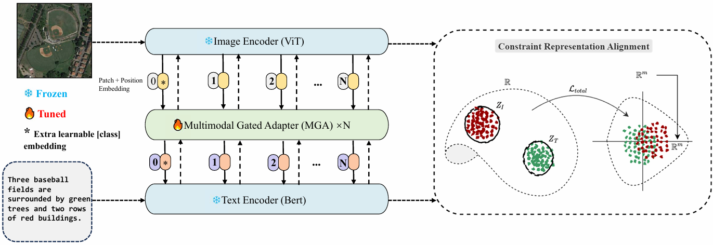

# HarMA

This repo is the official implementation of "[Efficient Remote Sensing with Harmonized Transfer Learning and Modality Alignment](https://arxiv.org/abs/2404.18253)"(ICLRW 2024).

- [Efficient Remote Sensing with Harmonized Transfer Learning and Modality Alignment](#a-harma)
  - [Introduction](#-Introduction)
  - [Implementation](#-Implementation)
    - [Environment Setup](#Environment Setup)
    - [Datasets](#datasets)
    - [Training](#Training)
    - [Testing](#Testing)
  - [Acknowledgement](#-Acknowledgement)
  - [Citation](#-Citation)

## Introduction

This paper proposes a framework for efficient remote sensing using Harmonized Transfer Learning and Modality Alignment (HarMA), addressing key challenges in the field of remote sensing image-text retrieval. HarMA leverages a unified perspective on multimodal transfer learning to enhance task performance, modality alignment, and single-modality uniform alignment. The core innovation lies in the hierarchical multimodal adapter inspired by the human brain's information processing, which integrates shared mini-adapters to improve fine-grained semantic alignment. By employing parameter-efficient fine-tuning, HarMA significantly reduces training overhead while achieving state-of-the-art performance on popular multimodal retrieval tasks without relying on external data. This approach outperforms fully fine-tuned models with minimal parameter adjustments, making it a versatile and resource-efficient solution for remote sensing applications. Experiments validate the effectiveness of HarMA, showcasing its potential to enhance vision and language representations in remote sensing tasks.



## Implementation

### Environment Setup

To set up the environment, run the following command:

```bash
pip install -r requirements.txt
```

### Datasets

All experiments are based on the [RSITMD](https://github.com/xiaoyuan1996/AMFMN/tree/master/RSITMD) and [RSICD](https://github.com/201528014227051/RSICD_optimal) datasets. 

You can also download the images from [Baidu Disk](https://pan.baidu.com/s/1mLkQA8InOxKjseGgEVoaew?pwd=c3c5) or [Google Drive](https://drive.google.com/file/d/140kYB3AEFv4Lp6pV1V0nQik115GaMl7i/view?usp=sharing) and modify the `configs/yaml` file in the configs directory accordingly:

```yaml
image_root: './images/datasets_name/'
```

The annotation files for the two datasets are located in the `data/finetune` directory.

### Training

If you encounter environmental issues, you can modify the `get_dist_launch` function in `run.py`. For example, for a 2-GPU setup:

```python
elif args.dist == 'f2':
        return "CUDA_VISIBLE_DEVICES=0,1 WORLD_SIZE=2 /root/miniconda3/bin/python -W ignore -m torch.distributed.launch --master_port 9999 --nproc_per_node=2 " \
               "--nnodes=1 "
```

To start training, run the following commands:

```bash
python run.py --task 'itr_rsitmd_vit' --dist "f2" --config 'configs/Retrieval_rsitmd_vit.yaml' --output_dir './checkpoints/HARMA/full_rsitmd_vit'

python run.py --task 'itr_rsicd_vit' --dist "f2" --config 'configs/Retrieval_rsicd_vit.yaml' --output_dir './checkpoints/HARMA/full_rsicd_vit'

python run.py --task 'itr_rsitmd_geo' --dist "f2" --config 'configs/Retrieval_rsitmd_geo.yaml' --output_dir './checkpoints/HARMA/full_rsitmd_geo'

python run.py --task 'itr_rsicd_geo' --dist "f2" --config 'configs/Retrieval_rsicd_geo.yaml' --output_dir './checkpoints/HARMA/full_rsitmd_geo'
```

### Testing

To evaluate the model, run the following commands:

```bash
python run.py --task 'itr_rsitmd_vit' --dist "f2" --config 'configs/Retrieval_rsitmd_vit.yaml' --output_dir './checkpoints/HARMA/test' --checkpoint './checkpoints/HARMA/full_rsitmd_vit/checkpoint_best.pth' --evaluate

python run.py --task 'itr_rsicd_vit' --dist "f2" --config 'configs/Retrieval_rsicd_vit.yaml' --output_dir './checkpoints/HARMA/test' --checkpoint './checkpoints/HARMA/full_rsicd_vit/checkpoint_best.pth' --evaluate

python run.py --task 'itr_rsitmd_geo' --dist "f2" --config 'configs/Retrieval_rsitmd_geo.yaml' --output_dir './checkpoints/HARMA/test' --checkpoint './checkpoints/HARMA/full_rstimd_geo/checkpoint_best.pth' --evaluate

python run.py --task 'itr_rsicd_geo' --dist "f2" --config 'configs/Retrieval_rsicd_geo.yaml' --output_dir './checkpoints/HARMA/test' --checkpoint './checkpoints/HARMA/full_rsicd_geo/checkpoint_best.pth' --evaluate
```

Note: We provide a Jupyter notebook for direct execution. Please refer to the `begin.ipynb` file. If you want to test or use the pre-trained models directly, you can download the checkpoints from [Checkpoints-v1.0.0](https://github.com/seekerhuang/HarMA/releases/tag/checkpoints).

## Citation

If you find this paper or repository useful for your work, please cite it as follows:

```bibtex
@article{huang2024efficient,
  title={Efficient Remote Sensing with Harmonized Transfer Learning and Modality Alignment},
  author={Huang, Tengjun},
  journal={arXiv preprint arXiv:2404.18253},
  year={2024}
}
```

## Acknowledgement

The code builds upon the excellent work of [PIR](https://github.com/jaychempan/PIR) by Pan et al.

